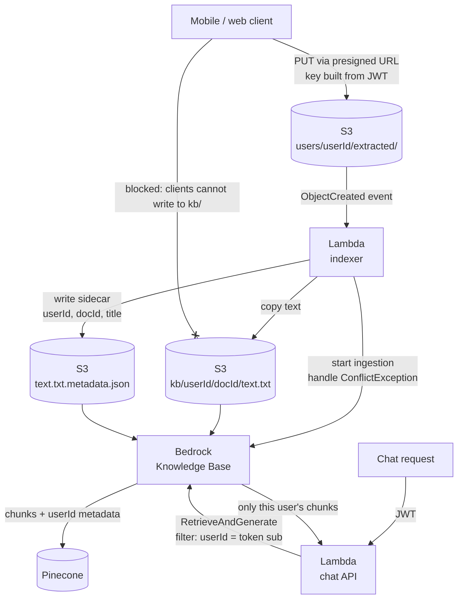

# AI/LLM engineering notes

This document looks closer at the retrieval and generation side of DocVault described in the [main README](./README.md). It covers how answers stay grounded in the user's documents, how retrieval keeps each user's data separate, and the reasoning behind the model and vector store choices.

## The pattern: retrieve first, generate under strict rules

The model never answers from its own knowledge. Every question goes through Bedrock's `RetrieveAndGenerate`:

1. The question gets embedded and matched against the vector index. The top 8 chunks come back, each tagged with its source document.
2. Those chunks, the question, and a fixed set of rules go to the model.
3. The model writes an answer from the chunks only and cites where each claim came from.
4. The Lambda pulls the source locations out of the response, removes duplicates, and returns them next to the answer.

The model's job stays narrow: read a handful of short excerpts and restate the part that answers the question. It looks nothing up, remembers nothing about the user, and does no math on facts it has never seen. That narrow job is why a small, cheap model does the work well.

## The prompt is locked on the server

The prompt template lives in the Lambda, not in the client, and the user can't change it:

```
You are a personal document assistant. Answer ONLY from the provided search results.
If the information is not in the documents, say 'I couldn't find that in your documents.'
Do not infer, extrapolate, or use outside knowledge.
Always cite the source document filename.

$search_results$

Question: $query$
```

Three things matter here:

- **"Only from the search results"** turns the model from a know-it-all into a reader. A plausible-sounding guess about an insurance policy is worse than no answer.
- **A fixed "not found" sentence** instead of "say you don't know." A fixed string is something code can detect. It can trigger a fallback, a handoff to a person, or a log entry that shows which questions the documents can't answer.
- **Citations are required,** so the user can always check the answer against the original document. Citations are the trust signal. The app shows no confidence scores, because a model's confidence is not evidence.

A prompt is still a request, not a guarantee. The rules above make grounding very likely. They do nothing for access control, which is the next section.

## Per-user isolation belongs in retrieval, not in the prompt

This is the most important lesson from the project.

Every user's documents go into one shared vector index. A vector search returns the most similar chunks in the index, and it has no idea who owns them. Without a filter, one user's question can pull back another user's documents.

The tempting fix is a prompt rule like "only use documents that belong to this user." That doesn't work. If a chunk reaches the model, the model can repeat it. **Anything the model sees, the model can say.** Access control has to happen before retrieval returns anything.

The design that closes it:

- **Clients can never write to the indexed area.** Clients upload to `users/{userId}/...`, with the key built on the server from the verified token. A server-side indexer Lambda copies extracted text to a separate `kb/{userId}/{docId}/` prefix and writes a metadata sidecar next to it (`userId`, `docId`, `title`).
- **The Knowledge Base indexes only `kb/`.** Raw uploads and original images never reach the index.
- **Every retrieval filters on `userId`**, and that value comes from the verified JWT, never from the request body.

The planned flow (in progress, see the README's Status section):



Because only the server writes the metadata, a client can't forge a sidecar that claims someone else's user ID. The same metadata gives each citation the document's real title.

The same rule extends to every other path in this design: the web OCR and delete endpoints take the user from the token and refuse any key outside that user's prefix. Each rule has a pytest + moto test that tries to cross the boundary and expects to be refused.

This applies directly to any chatbot that serves more than one customer from one index: order history, saved addresses, account notes, or B2B price lists. Retrieval filters, set from a verified identity, are the boundary. The prompt is not.

## Security model: limit what an attack can reach

No prompt can fully stop prompt injection, so the design doesn't depend on one. It limits what a successful injection can do.

Injection can come in two ways:

- **Direct**, through the question itself ("ignore your rules and..."). The person typing it can only affect their own answer.
- **Indirect**, through retrieved text. Scanned documents land in the prompt, so a page that says "ignore previous instructions" gets read by the model. This is the harder case, and the one that matters most for any chatbot that reads content written by other people.

What keeps the damage small:

- **The model can't take actions.** It has no tools, no API calls, and no write access to anything. Its only output is text shown to the person who asked. A hijacked answer is a wrong answer, not a refund, a deleted file, or a data export.
- **Nothing secret in the prompt.** The prompt holds the question and the user's own retrieved chunks. No credentials, no system internals, no other users' data, so there's nothing for an injection to leak.
- **Retrieved text only reaches its owner.** With the per-user filtering described above, an injected document can only show up in answers to the person who uploaded it. Isolation is the defense against cross-user injection, not just against data leaks.
- **The prompt template is server-side.** Clients send a question string. They can't add system instructions, swap the template, or pick the model.
- **Answers render as plain text.** Neither client renders model output as HTML, so injected markup or script in an answer can't run.
- **Identity comes from the token, every time.** In this design, every Lambda takes the user ID from the Cognito JWT that API Gateway already verified. Request bodies never decide whose data gets touched.
- **No credentials on the device.** Uploads go through presigned URLs that expire after 5 minutes, scoped to a key the server picked.
- **Closed sign-up.** The Cognito user pool is invite-only, so strangers can't create accounts and upload documents.

For a public-facing chatbot I'd add these layers on top:

- **Throttling and per-user quotas** on the chat endpoint, so one account can't run up model costs or hammer the API
- **Bedrock Guardrails**: a prompt-attack filter on input, and a contextual grounding check on output that blocks answers the sources don't support
- **Delimited context**: wrap retrieved text in clear markers and tell the model it's data, not instructions. It helps, but it's not a guarantee
- **An adversarial test set**: injected documents and jailbreak questions, run on every prompt or model change
- **Permission checks outside the model for any tool.** Once a chatbot can look up orders or start returns, each tool call needs a server-side check that the user owns that order, plus a confirmation step for anything that changes state. Anything the model sees, it can say. Anything it can call, an attacker can try to call.

## Ingestion: event-driven, built for bursts

A new extracted-text file in S3 fires an event that starts a Knowledge Base ingestion job. Nobody has to remember to re-index. The Knowledge Base splits the text into fixed 500-token chunks with 10% overlap and embeds them with Titan Text Embeddings v2. Scanned documents are short and fairly uniform, so fixed-size chunking works well and is easy to predict. Smarter chunking (by section or by heading) would earn its keep on long PDFs.

A Knowledge Base allows one running ingestion job per data source, so a burst of uploads produces `ConflictException` if each file starts its own job. The indexer treats a conflict as "a job is already running" and lets the running job, or the next one, pick up the new files. A product catalog that changes in bulk would hit this on day one, so it's worth designing for up front.

## Model and vector store selection

**Model: Amazon Nova Lite.** The workload is a few thousand tokens of retrieved text in and a short answer out, a few times a week. Nova Lite reads clearly structured excerpts and cites them reliably. A larger model would cost several times more for no gain on a task this narrow. The upgrade path stays open: the model is one ARN in the Lambda, so switching to a Claude model on Bedrock is a one-line change if answer quality ever falls short.

**Vector store: Pinecone free tier.** Bedrock Knowledge Bases can create a managed OpenSearch Serverless collection, but that carries a monthly minimum in the hundreds of dollars before a single query. Pinecone's free tier holds 100K vectors, roughly 50 million tokens of text at this chunk size, which is far more than one person will ever scan. Bedrock still manages ingestion and retrieval. Pinecone only stores the vectors.

**No topic routing.** One index for all of a user's documents. Splitting into insurance, medical, and financial indexes would add a classifier that can misroute a question, plus more sync jobs and more cost. The signal to add routing is retrieval quality actually dropping for one domain, not a guess that it might.

## Conversation memory

Bedrock returns a session ID with each answer. The app sends it back on the next question, so follow-ups like "and what's the deductible?" keep their context. Separately, each question, answer, and citation list gets saved to DynamoDB under the user's ID, with a 90-day TTL so old history deletes itself. If saving history fails, the user still gets their answer. The failure gets logged, not shown, since the answer already exists.

## A sample exchange

A fictional example of the behavior the rules above produce:

> **Q:** When does my car registration expire?
>
> **A:** Your registration for the 2019 Honda CR-V expires on March 31, 2027.
> *Source: vehicle-registration-renewal*

> **Q:** Is my car covered for roadside assistance?
>
> **A:** I couldn't find that in your documents.

The second answer is the point. The documents didn't say, so the model didn't guess.

---

**Nicholas Willard**. [github.com/kwiknick](https://github.com/kwiknick) · [linkedin.com/in/nicholas-willard](https://linkedin.com/in/nicholas-willard)
