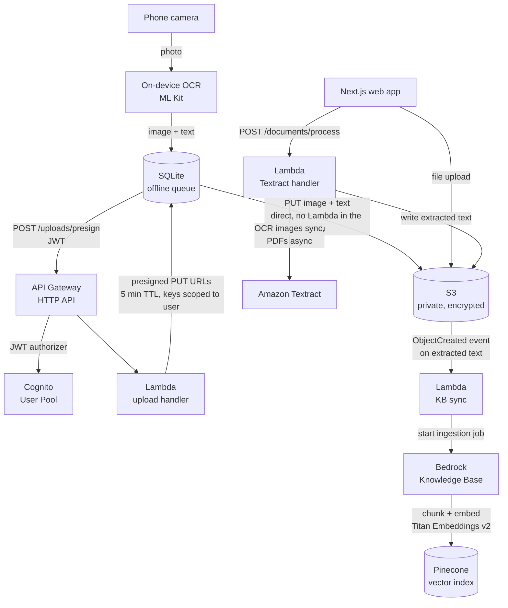
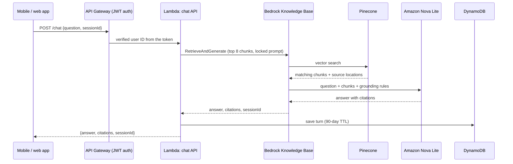

# DocVault: Grounded AI Chat Over Your Own Documents

By **Nicholas Willard**. [GitHub](https://github.com/kwiknick) · [LinkedIn](https://linkedin.com/in/nicholas-willard)

DocVault is a mobile app, a web app, and a serverless AWS backend. Together they turn a pile of paper into a knowledge base you can ask questions in plain English. You scan a document with your phone. The app reads the text on the device, uploads the image and text to private storage, and indexes the text for retrieval. Later you ask "when does my car registration expire?" or "what does my insurance cover for physical therapy?" and get an answer drawn only from your own documents, with the source document cited.

This repo documents the architecture and the engineering decisions. The production source stays private for now, because the system holds personal documents (insurance, medical, financial).

Read **[AI-DESIGN.md](./AI-DESIGN.md)** for the retrieval, grounding, and LLM-reliability approach in detail.

Building a customer-facing AI chatbot, such as an e-commerce shopping or support assistant? Jump to **[How this maps to a customer-facing AI chatbot](#how-this-maps-to-a-customer-facing-ai-chatbot)**.

---

## What it does

1. **Scan.** Point the phone camera at a document and tap once. Text recognition runs on the device, so the image never goes to a third-party OCR service.
2. **Upload.** The app saves the job to a local queue first, then uploads the image and the extracted text straight to S3 through short-lived presigned URLs. No connection? The job waits in the queue and retries later.
3. **Index.** A new text file in S3 triggers ingestion into a Bedrock Knowledge Base. The text gets chunked, embedded, and stored in a vector index.
4. **Ask.** The chat screen sends a question to a Lambda function. The function retrieves the most relevant chunks, has the model answer only from those chunks, and returns the answer plus the source documents it used.
5. **Browse.** A list or grid of every document, with a fullscreen viewer and delete.

A Next.js web app offers the same scan, chat, and browse features on desktop. A browser has no on-device OCR, so web uploads go through Amazon Textract instead.

---

## Architecture

### Scan, upload, and index

### Ask a question

---

## What this demonstrates

**AI and LLM engineering** (details in [AI-DESIGN.md](./AI-DESIGN.md)):

- **Retrieval-augmented generation (RAG) end to end**: ingestion, chunking, embeddings, vector search, grounded generation, and citations, all on managed AWS services.
- **Grounding over fluency.** The prompt template is locked on the server. The model answers only from retrieved text, cites the source, and returns a fixed "I couldn't find that in your documents" message instead of guessing.
- **Per-user data isolation in a shared vector index.** Only the server writes what gets indexed, and every query filters by the user ID from the verified token. Details in AI-DESIGN.md.
- **Cost-driven model and vector store choices.** A small, cheap model for answers, and a free-tier vector store instead of a managed one with a high monthly floor.
- **Conversation continuity**: Bedrock session IDs for multi-turn context, plus a per-user chat history in DynamoDB that expires on its own.

**AWS services used:**

- **Amazon Bedrock Knowledge Bases**: managed ingestion and `RetrieveAndGenerate`, with fixed-size chunking (500 tokens, 10% overlap) and Titan Text Embeddings v2
- **Amazon Bedrock (Nova Lite)**: answer generation with citations
- **Pinecone**: external vector store behind the Knowledge Base, with its API key held in Secrets Manager
- **Lambda (Python 3.12)**: upload presign, document list and delete, chat, Textract OCR, and Knowledge Base sync, each with its own IAM role
- **API Gateway (HTTP API) + Cognito**: a JWT authorizer on every route, an invite-only user pool, SRP sign-in, and no client secret on the devices
- **S3**: a private, encrypted, versioned bucket with every key under `users/{userId}/`
- **DynamoDB**: chat history keyed by user, with TTL expiry
- **Amazon Textract**: OCR for web uploads, synchronous for images and asynchronous for PDFs
- **CloudFront + S3**: static hosting for the web app, with origin access control
- **CloudWatch**: a billing alarm as a cost guardrail
- **AWS CDK (Python)**: all of the above as infrastructure as code

**Client engineering:**

- **React Native (Expo, TypeScript)** for iOS and Android, and **Next.js + Tailwind** for the web
- **Offline-first upload queue** in SQLite: every scan persists locally before any network call, with automatic retries (max 3) and a `failed` state
- **Clean layering**: typed service interfaces and DTOs, and screens depend on services, never the other way around
- **Testing**: about 185 Jest unit and component tests, Stryker mutation testing on the service layer, live tests against real AWS run on demand, and pytest + moto for the Lambdas
- **CI with GitHub Actions**: type checks, tests, and web builds on every PR, plus EAS cloud builds for mobile

---

## Engineering highlights

**OCR happens on the phone.** ML Kit reads the text on the device. No per-page OCR bill, no cloud round trip, and the image never goes to a third-party OCR API. The web app has no such option, so it uses Textract, the right tool for that client, not a one-size-fits-all choice.

**The app never holds AWS credentials.** The upload Lambda builds the S3 key from the user ID in the verified token and returns a presigned PUT URL that expires in 5 minutes. The client uploads straight to S3. The Lambda never touches the bytes, so it stays fast and cheap, and the client can never pick where its file lands.

**Offline-first by default.** A scan is saved to a local SQLite queue before the app tries the network. A bad connection doesn't lose a document. It delays it.

**Multi-tenant from day one.** Every S3 path starts with `users/{userId}/`. This cost nothing when the app had one user, and it made adding Cognito accounts a configuration change instead of a data migration.

**Access control is tested, not assumed.** Before releasing the source, I ran a whole-repo authorization review and wrote a pytest + moto test for each access rule: a user can't read, OCR, overwrite, delete, or retrieve another user's documents. Each test tries to cross the boundary and expects to be refused.

---

## How this maps to a customer-facing AI chatbot

DocVault answers questions about personal documents, but the hard parts carry over to an e-commerce shopping or support assistant almost one for one.

| E-commerce chatbot need | How DocVault handles the same problem |
|---|---|
| Answer from the real catalog, return policy, and FAQ, never from the model's imagination | RAG over a Bedrock Knowledge Base, with a locked prompt that forbids outside knowledge and a fixed "not found" reply |
| Show customers where an answer came from | Citations on every answer, mapped back to the source document |
| Keep the index fresh as products and policies change | Event-driven ingestion: a new or changed file in S3 triggers re-indexing automatically |
| Never show one customer another customer's orders or data | Per-user metadata filtering on retrieval, with the user ID taken from the verified JWT and never from the request body |
| Multi-turn conversations ("does it come in blue?") | Bedrock session IDs for context, and chat history in DynamoDB with TTL |
| Keep the cost per conversation low at high volume | A small model (Nova Lite) chosen on purpose, a free-tier vector store, serverless everywhere, and a billing alarm |
| Web and mobile clients on one backend | One Cognito-authenticated API shared by a React Native app and a Next.js site |
| Untrusted input from the public internet | JWT authorizer on every route, server-built storage keys, least-privilege IAM per Lambda, generic error messages |

**What I'd add for e-commerce,** building on lessons from this project and my [training-tracker](https://github.com/kwiknick/training-tracker-showcase) project:

- **Live facts through tool calls, not the vector index.** Price, stock, and order status change by the minute. They belong in a tool call to the source system at answer time, not in a vector index that might be hours stale. This is the same rule I follow elsewhere: anything that must be exactly right comes from code, not from the model's memory.
- **An evaluation set before launch.** A fixed list of real customer questions with expected answers and expected sources, run on every prompt or model change, to catch regressions in retrieval and grounding.
- **Bedrock Guardrails** for topic limits, PII redaction, and contextual grounding checks, which are already in my cost model as the next tier.
- **Structured metadata on chunks** (category, brand, price band) so retrieval can filter before it ranks, the same mechanism DocVault uses for per-user isolation.
- **Handoff to a human** when the model returns "not found" or the customer asks for one, with the conversation history attached.

---

## Key decisions and tradeoffs

| Decision | Why | Rejected alternative |
|---|---|---|
| Bedrock Knowledge Base, not a hand-built RAG pipeline | Managed chunking, embedding, ingestion, and citations. I spend my time on grounding and access control, not glue code. | LangChain plus a custom ingestion pipeline: more control, more code to own |
| Pinecone free tier as the vector store | $0 at personal scale, and 100K vectors covers years of documents | OpenSearch Serverless: a monthly floor in the hundreds of dollars before a single query |
| Nova Lite as the answer model | The model's job is narrow (rephrase retrieved text and cite it), so a small model handles it at a fraction of the cost | Larger models: several times the cost for no gain on this task |
| One Knowledge Base, no topic routing | One user's documents are distinct enough that one index retrieves well. A router adds a classifier that can misroute. | One index per domain (insurance, medical, ...): more sync jobs, more cost, more failure modes |
| On-device OCR on mobile | Free, private, works offline | Server OCR for everything: per-page cost and an extra network trip |
| Presigned URLs | No credentials on the device, no Lambda in the upload path | Uploading through Lambda: slower, costs more, payload size limits |
| Cognito JWT on every route | User ID comes from a verified token, so access control never trusts the request body | API keys: one shared secret, no per-user identity |

---

## Cost

Designed to run for one person at roughly **$2 to $5 per month**. Knowledge Base ingestion and S3 storage make up most of it. Answer generation costs a fraction of a cent per question. Lambda, API Gateway, and DynamoDB stay within free-tier levels at this scale. Pinecone's free tier covers the vector index. A CloudWatch billing alarm fires at $10, so a mistake can't run up a surprise bill.

---

## Status

DocVault works end to end on Android and the web: scan, upload, index, chat with citations, browse, and delete. The source is being prepared for public release. The last step before that is finishing the server-side indexer and per-user retrieval filtering described in AI-DESIGN.md, plus least-privilege IAM tightening. The access-control tests for that work are already written.

---

*This is a companion showcase repo. The production source, documents, and infrastructure configuration stay in a private repository for now. This repo documents the architecture and engineering decisions only. No application code, credentials, or personal data live here.*

---

**Nicholas Willard**. [github.com/kwiknick](https://github.com/kwiknick) · [linkedin.com/in/nicholas-willard](https://linkedin.com/in/nicholas-willard)
